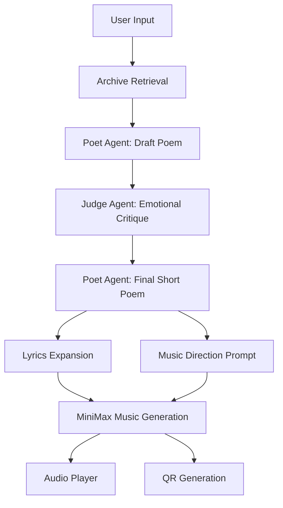
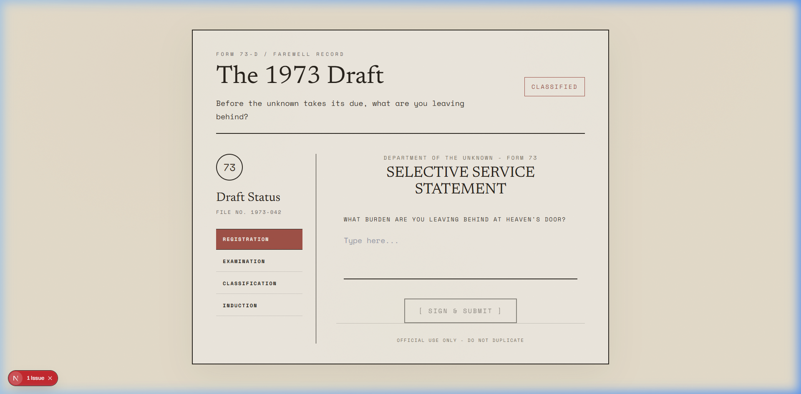
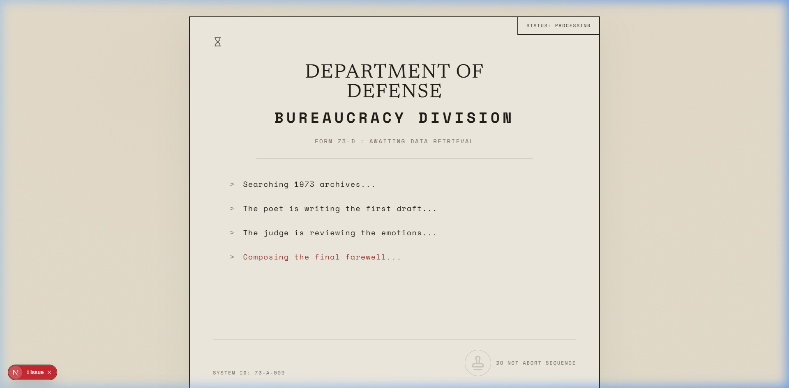
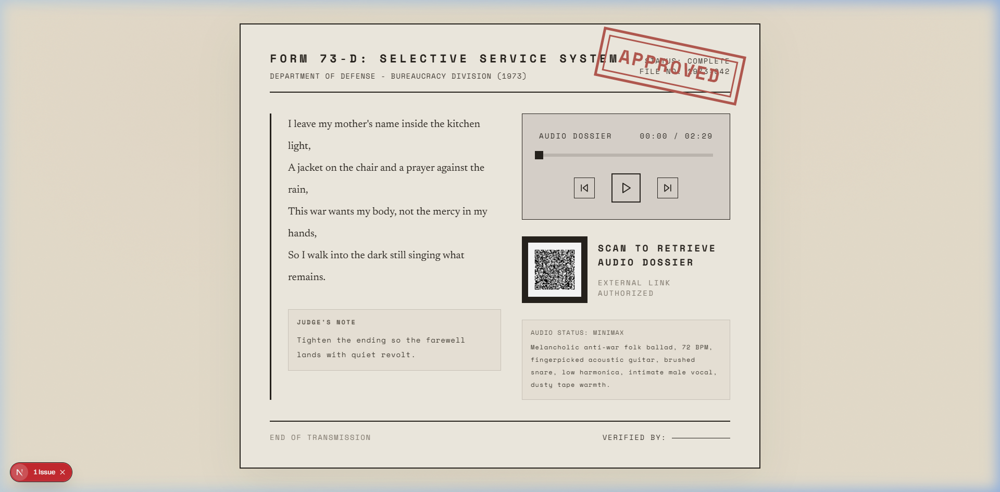

# The 1973 Draft

An interactive generative web artwork built for CSE 358: Introduction to Artificial Intelligence.

Inspired by Bob Dylan's 1973 atmosphere around "Knockin' on Heaven's Door," this project stages a farewell ritual inside a fictional draft-office archive. The user writes a single sentence about what they are leaving behind, and the system transforms that confession into a contextualized anti-war poem, a judged revision, a full song lyric sheet, a generated musical response, and a QR-accessible audio dossier.

## Brief Artistic Statement

The 1973 Draft imagines bureaucracy as a threshold machine. A single form entry becomes a record of grief, protest, memory, and departure. The project does not treat AI as a novelty layer on top of a static artwork; instead, AI is used as the engine of transformation, turning a personal sentence into an evolving artifact shaped by history, poetic revision, and musical reinterpretation. The intended result is a document that feels simultaneously intimate and institutional, personal and historical, human and machine-mediated.

## Assignment Fit

This project is designed around the three mandatory constraints in the course brief:

1. `At least 2 AI techniques`
   - Retrieval-augmented text generation
   - LLM-based poetic generation and critique
   - AI lyrics generation
   - AI music generation
2. `Original code`
   - Custom frontend, backend, streaming pipeline, prompt orchestration, retrieval logic, QR generation, and API integration
3. `Historical context`
   - The project embeds 1973 draft-era language, anti-war sensibility, Dylan-adjacent references, and archival framing into both the dataset and interface

## AI Techniques Used

### 1. Retrieval-Augmented Generation

The system retrieves the most relevant archive fragments from a manually curated 1973-inspired corpus before writing the poem.

### 2. LLM-Based Poetry Generation and Critique

MiniMax text models generate:
- the first-draft poem
- the judge's emotional critique
- the revised short poem
- the music direction prompt

### 3. AI Lyrics Expansion

To avoid short, fragmentary music generations, the project separately produces a fuller structured song lyric sheet from the final poem.

### 4. AI Music Generation

MiniMax music generation creates an audio response from the generated lyrics and music-direction prompt.

## How The Techniques Interact



## Technical Architecture Overview

### Frontend

- Next.js App Router
- React
- Tailwind CSS
- Framer Motion

The frontend sends a single request to the backend and listens to a streaming response. It presents the work as a 1973-style bureaucratic document, with a submission form, a staged loading sequence, and a final stamped dossier view.

### Backend

- FastAPI
- Python
- SSE-style streaming response
- Local retrieval layer over a manual archive dataset

The backend orchestrates the full creative pipeline and returns staged progress updates plus the final artifact bundle.

### External APIs

- MiniMax text chat endpoint
- MiniMax lyrics generation endpoint
- MiniMax music generation endpoint

## AI Tools, Models, and APIs Used

### AI Tools

- MiniMax
- Retrieval-augmented prompting over a local archive corpus

### Models

- `MiniMax-M2.7` for text generation and critique
- `music-2.6` for music generation

### API Surfaces

- `POST /v1/chat/completions`
- `POST /v1/lyrics_generation`
- `POST /v1/music_generation`

## Project Structure

```text
.
|-- backend
|   |-- app
|   |   |-- data
|   |   |   `-- seed_documents.py
|   |   |-- services
|   |   |   |-- ai_clients.py
|   |   |   |-- pipeline.py
|   |   |   |-- qr_code.py
|   |   |   `-- rag.py
|   |   |-- main.py
|   |   `-- schemas.py
|   `-- requirements.txt
|-- docs
|   |-- ARTIST_MANIFESTO.md
|   `-- SUBMISSION_CHECKLIST.md
`-- frontend
    |-- app
    |-- components
    |-- lib
    `-- package.json
```

## Local Setup

### Backend

```bash
cd backend
python -m venv .venv
.venv\Scripts\activate
pip install -r requirements.txt
copy .env.example .env
python -m uvicorn app.main:app --reload --port 8000
```

### Frontend

```bash
cd frontend
npm install
copy .env.local.example .env.local
npm run dev
```

- Frontend runs on `http://localhost:3000`
- Backend runs on `http://localhost:8000`

## Environment Variables

### Backend

- `MINIMAX_API_KEY`
- `MINIMAX_TEXT_API_URL`
- `MINIMAX_TEXT_MODEL`
- `MINIMAX_LYRICS_API_URL`
- `MINIMAX_MUSIC_API_URL`
- `MINIMAX_MUSIC_MODEL`
- `MINIMAX_MUSIC_OUTPUT_FORMAT`
- `FRONTEND_ORIGIN`

### Frontend

- `NEXT_PUBLIC_API_BASE_URL`

## Dependencies and API Requirements

### Python

- `fastapi`
- `uvicorn`
- `httpx`
- `pydantic`
- `python-dotenv`
- `qrcode[pil]`

### JavaScript

- `next`
- `react`
- `react-dom`
- `tailwindcss`
- `framer-motion`
- `lucide-react`

### API Access

This project requires a valid MiniMax API key for full text, lyrics, and music generation. If no valid key is provided, the backend falls back gracefully for demo continuity.

## Example Output


*Archival Form 73-D: Selective Service Statement*


*System Sequence: Awaiting data retrieval and drafting*


*Final Approved Dossier: Generated poem, lyrics, and audio response*

Example user input:

> I am leaving behind my mother's voice in the kitchen and the version of me that still believed duty was noble.

## RAG Dataset

The archive data is manually maintained in:

- [backend/app/data/seed_documents.py](backend/app/data/seed_documents.py)

If you want to add more letters, Dylan-adjacent fragments, research notes, anti-war diary excerpts, Vietnam-era language, film references, or bureaucratic archival text, add more entries to that list.

Current retrieval logic is implemented in:

- [backend/app/services/rag.py](backend/app/services/rag.py)

Right now this repo uses a lightweight local similarity layer instead of a full ChromaDB runtime, chosen to keep Windows setup simple and reliable.

### Corpus Provenance Note

The archive corpus is intentionally hybrid:

- Some entries are original synthetic reconstructions written for the artwork in a 1973-informed voice
- Some entries are interpretive commentary or paraphrased cultural notes about Dylan, the draft era, and anti-war feeling
- Some entries reference historical context such as the Paris Peace Accords or *Pat Garrett & Billy the Kid* (1973)
- Any direct lyrical quotation should be kept short and clearly identifiable as a Dylan reference rather than presented as original archival writing

This structure is deliberate: the dataset is not meant to function as a documentary archive, but as a historically informed creative memory field for retrieval-augmented generation.

For a short transparency note on historical references and corpus construction, see:

- [docs/SOURCES_AND_REFERENCES.md](docs/SOURCES_AND_REFERENCES.md)

## Deliverables Included In Repo

- Working artwork implementation
- Full source code
- Setup instructions
- Architecture overview
- AI techniques list
- Final artist manifesto
- Submission checklist
- Sources and references note

## Notes

- The UI is styled as a vintage 1973 military bureaucracy document.
- The loading state, form surface, and result page are all treated as archival paper artifacts.
- If MiniMax does not return a usable music output, the app falls back instead of crashing.
- `.env` files are intentionally excluded from version control.
